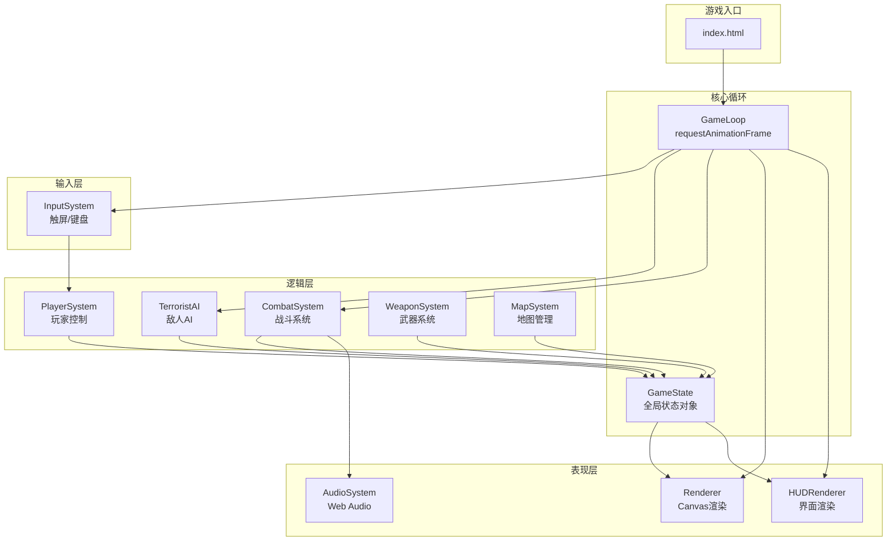
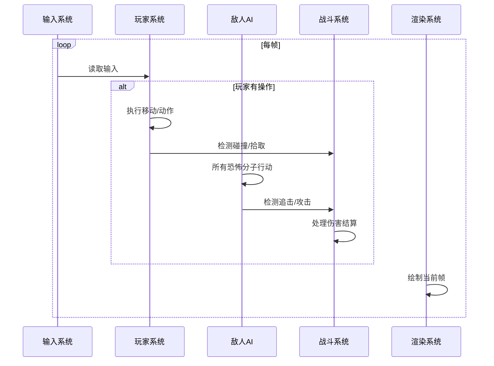
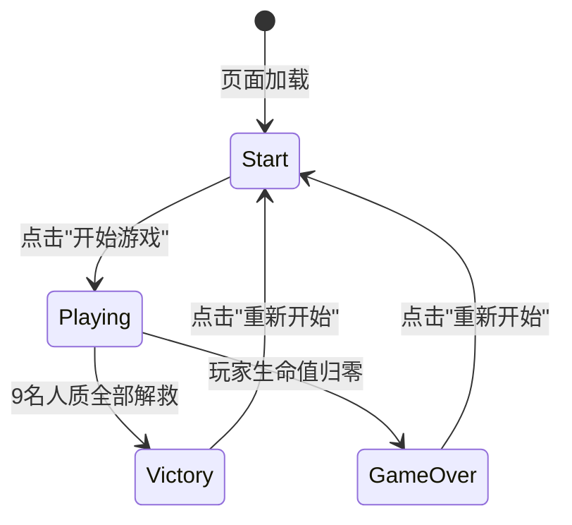

# 技术设计文档：床下潜伏解救人质游戏

## 概述

本游戏是一款基于网页的俯视角战术潜行游戏，采用纯前端技术栈（HTML + CSS + JavaScript）实现，可直接部署到 GitHub Pages。玩家在3层9x9网格建筑中潜行，利用躲藏、武器和战术决策解救9名人质。

### 设计目标

- **单文件优先**：尽量将所有代码集中在一个 `index.html` 文件中，内联 CSS 和 JavaScript，简化部署
- **移动端优先**：以触屏操作为主要输入方式设计，同时兼容桌面键盘
- **回合制+实时混合**：玩家移动为回合制（每次移动一格），敌人AI在玩家行动后响应，但渲染以 requestAnimationFrame 驱动保持流畅
- **程序化音效**：所有音效通过 Web Audio API 实时合成，无需外部音频文件

### 技术选型决策

| 决策项 | 选择 | 理由 |
|--------|------|------|
| 渲染方式 | HTML5 Canvas | 9x9网格渲染性能好，适合频繁重绘，比DOM操作更高效 |
| 游戏循环 | requestAnimationFrame + 回合制逻辑 | 渲染流畅（≥30fps），逻辑按回合推进，简化AI和碰撞计算 |
| 音频方案 | Web Audio API OscillatorNode | 无需加载外部文件，支持程序化生成各种音效 |
| 寻路算法 | 简化A*算法 | 9x9网格规模小，自实现A*即可满足需求，无需引入外部库 |
| 状态管理 | 单一全局状态对象 | 游戏规模小，无需复杂状态管理框架 |
| 文件结构 | 单HTML文件 | 满足GitHub Pages部署要求，无构建步骤 |

## 架构

### 整体架构

游戏采用**组件化的游戏循环架构**，所有系统围绕一个中心游戏状态对象运作。



### 游戏循环流程



### 回合制逻辑说明

游戏采用"玩家行动触发"的回合制：
1. 玩家执行一次移动或动作 → 算作一个"回合"
2. 玩家回合结束后，所有恐怖分子依次执行一步移动
3. 结算碰撞、伤害、拾取等事件
4. 渲染系统持续以 requestAnimationFrame 刷新画面（动画、UI过渡等）

这种设计让玩家有充足时间思考战术，同时保持视觉流畅。


## 组件与接口

### 1. GameState（全局状态对象）

游戏的核心数据容器，所有系统读写此对象。

```javascript
// GameState 接口定义
const GameState = {
  phase: 'start' | 'playing' | 'victory' | 'gameover',
  currentFloor: 1,          // 当前显示楼层 (1-3)
  turnCount: 0,             // 回合计数
  startTime: null,           // 游戏开始时间戳
  eliminatedCount: 0,       // 消灭敌人计数（胜利画面展示用）
  player: PlayerState,
  terrorists: TerroristState[],
  hostages: HostageState[],
  maps: MapData[3],          // 3层地图数据
  items: ItemState[],        // 地面物品
  fireZones: FireZone[],     // 燃烧弹火焰区域
  notifications: Notification[], // UI通知队列
  audioEnabled: true
};
```

### 2. MapSystem（地图系统）

负责地图数据管理和地形查询。

```javascript
// MapSystem 接口
const MapSystem = {
  // 初始化3层地图
  initMaps(): MapData[3],

  // 查询指定位置的地形类型
  getTile(floor, x, y): TileType,

  // 检查指定位置是否可通行
  isWalkable(floor, x, y): boolean,

  // 获取指定楼层的楼梯位置
  getStaircase(floor, direction): {x, y} | null,

  // 获取视线路径上的所有格子（用于射击判定）
  getLineOfSight(floor, fromX, fromY, direction): {x, y}[]
};

// TileType 枚举
const TileType = {
  FLOOR: 0,      // 地板（可通行）
  WALL: 1,       // 墙壁（不可通行）
  BED: 2,        // 床（可躲藏）
  STAIR_UP: 3,   // 上楼梯
  STAIR_DOWN: 4  // 下楼梯
};
```

### 3. InputSystem（输入系统）

统一处理触屏和键盘输入，输出标准化的动作指令。

```javascript
// InputSystem 接口
const InputSystem = {
  // 初始化输入监听
  init(canvas, controlsContainer): void,

  // 获取当前帧的输入动作（每帧调用一次，消费后清空）
  consumeAction(): Action | null,

  // 注册触屏方向按钮和动作按钮
  setupTouchControls(): void,

  // 注册键盘监听
  setupKeyboardControls(): void
};

// Action 类型
type Action =
  | { type: 'move', direction: 'up' | 'down' | 'left' | 'right' }
  | { type: 'fire' }
  | { type: 'hide' }
  | { type: 'switchWeapon' }
  | { type: 'useStairs' };
```

### 4. PlayerSystem（玩家系统）

处理玩家状态更新和动作执行。

```javascript
// PlayerSystem 接口
const PlayerSystem = {
  // 处理玩家移动
  move(state, direction): GameState,

  // 切换躲藏状态
  toggleHide(state): GameState,

  // 切换武器
  switchWeapon(state): GameState,

  // 开火
  fire(state): GameState,

  // 拾取物品（移动后自动触发）
  pickupItems(state): GameState,

  // 使用楼梯
  useStairs(state): GameState
};
```

### 5. TerroristAI（敌人AI系统）

管理所有恐怖分子的行为逻辑。

```javascript
// TerroristAI 接口
const TerroristAI = {
  // 所有存活恐怖分子执行一步（玩家回合结束后调用）
  updateAll(state): GameState,

  // 单个恐怖分子的行为决策
  decide(terrorist, state): AIAction,

  // 检测玩家是否在视线范围内（2格直线距离）
  canDetectPlayer(terrorist, player, map): boolean,

  // A*寻路到目标位置
  findPath(floor, fromX, fromY, toX, toY, map): {x, y}[],

  // 生成巡逻路径
  generatePatrolPath(terrorist, map): {x, y}[]
};

// AIAction 类型
type AIAction =
  | { type: 'patrol', target: {x, y} }
  | { type: 'chase', target: {x, y} }
  | { type: 'attack' };
```

### 6. CombatSystem（战斗系统）

处理所有伤害计算和战斗结算。

```javascript
// CombatSystem 接口
const CombatSystem = {
  // 玩家对恐怖分子造成伤害
  damageToTerrorist(state, terroristIndex, damage): GameState,

  // 恐怖分子对玩家造成伤害（考虑防具减伤）
  damageToPlayer(state, damage): GameState,

  // 计算防具减伤后的实际伤害
  calculateDamage(baseDamage, armor): { actualDamage: number, armorDamage: number },

  // 处理手榴弹爆炸（范围伤害）
  grenadeExplosion(state, targetX, targetY): GameState,

  // 处理燃烧弹（创建火焰区域）
  incendiaryExplosion(state, targetX, targetY): GameState,

  // 处理火焰区域伤害（每回合）
  processFireZones(state): GameState
};
```

### 7. WeaponSystem（武器系统）

管理武器属性和弹药。

```javascript
// WeaponSystem 接口
const WeaponSystem = {
  // 获取武器伤害值
  getDamage(weaponType): number,

  // 检查武器是否可以开火
  canFire(weapon): boolean,

  // 消耗弹药
  consumeAmmo(weapon): WeaponState,

  // 获取武器射程类型
  getRangeType(weaponType): 'line' | 'radius' | 'tile'
};
```

### 8. AudioSystem（音频系统）

使用 Web Audio API 程序化生成所有音效。

```javascript
// AudioSystem 接口
const AudioSystem = {
  // 初始化 AudioContext（需要用户交互后调用）
  init(): void,

  // 播放背景音乐（循环）
  playBGM(): void,

  // 停止背景音乐
  stopBGM(): void,

  // 播放音效
  playSFX(type: SFXType): void,

  // 切换静音
  toggleMute(): void
};

// SFXType 枚举
const SFXType = {
  PISTOL_FIRE: 'pistol',
  AK47_FIRE: 'ak47',
  EXPLOSION: 'explosion',
  RESCUE: 'rescue',
  DAMAGE: 'damage',
  PICKUP: 'pickup',
  STEP: 'step'
};
```

### 9. Renderer（渲染系统）

负责 Canvas 绘制和 HUD 渲染。

```javascript
// Renderer 接口
const Renderer = {
  // 初始化Canvas
  init(canvas): void,

  // 渲染当前帧
  render(state): void,

  // 渲染地图层
  renderMap(floor, mapData): void,

  // 渲染实体（玩家、恐怖分子、人质）
  renderEntities(state): void,

  // 渲染火焰区域
  renderFireZones(fireZones): void,

  // 渲染HUD（生命值、武器、弹药、防具、人质计数）
  renderHUD(state): void,

  // 渲染通知消息
  renderNotifications(notifications): void,

  // 计算格子大小（响应式）
  calculateTileSize(): number
};
```


## 数据模型

### 地图数据

每层地图用一个 9x9 的二维数组表示，每个元素为 TileType 枚举值。

```javascript
// 地图数据结构
const MapData = {
  floor: number,           // 楼层编号 (1-3)
  tiles: number[][],       // 9x9 地形数组
  // tiles[y][x] = TileType
};

// 预定义地图（硬编码在代码中）
// 0=地板, 1=墙壁, 2=床, 3=上楼梯, 4=下楼梯
const FLOOR_1 = [
  [1,1,1,1,1,1,1,1,1],
  [1,0,0,0,1,0,0,0,1],
  [1,0,2,0,0,0,2,0,1],
  [1,0,0,0,1,0,0,0,1],
  [1,1,0,1,1,1,0,1,1],
  [1,0,0,0,1,0,0,0,1],
  [1,0,2,0,0,0,0,0,1],
  [1,0,0,0,1,0,0,3,1],
  [1,1,1,1,1,1,1,1,1],
];
// Floor 1: 上楼梯在 (7,7)，无下楼梯

const FLOOR_2 = [
  [1,1,1,1,1,1,1,1,1],
  [1,0,0,0,0,0,0,0,1],
  [1,0,2,0,1,0,2,0,1],
  [1,0,0,0,1,0,0,0,1],
  [1,0,1,0,0,0,1,0,1],
  [1,0,0,0,1,0,0,0,1],
  [1,0,2,0,1,0,0,0,1],
  [1,4,0,0,0,0,0,3,1],
  [1,1,1,1,1,1,1,1,1],
];
// Floor 2: 下楼梯在 (1,7)，上楼梯在 (7,7)

const FLOOR_3 = [
  [1,1,1,1,1,1,1,1,1],
  [1,0,0,0,1,0,0,0,1],
  [1,0,2,0,0,0,0,0,1],
  [1,0,0,0,1,0,2,0,1],
  [1,1,0,1,0,1,0,1,1],
  [1,0,0,0,0,0,0,0,1],
  [1,0,0,0,1,0,2,0,1],
  [1,4,0,0,1,0,0,0,1],
  [1,1,1,1,1,1,1,1,1],
];
// Floor 3: 下楼梯在 (1,7)，无上楼梯

// ---- 楼梯连接逻辑 ----
// 上楼：玩家踏上 STAIR_UP(3) 后，传送到上一层的 STAIR_DOWN(4) 位置
// 下楼：玩家踏上 STAIR_DOWN(4) 后，传送到下一层的 STAIR_UP(3) 位置
// 具体连接关系：
//   Floor 1 STAIR_UP(7,7) → Floor 2 STAIR_DOWN(1,7)  玩家出现在 Floor 2 的 (1,7)
//   Floor 2 STAIR_DOWN(1,7) → Floor 1 STAIR_UP(7,7)  玩家出现在 Floor 1 的 (7,7)
//   Floor 2 STAIR_UP(7,7) → Floor 3 STAIR_DOWN(1,7)  玩家出现在 Floor 3 的 (1,7)
//   Floor 3 STAIR_DOWN(1,7) → Floor 2 STAIR_UP(7,7)  玩家出现在 Floor 2 的 (7,7)
```

### 玩家状态

```javascript
const PlayerState = {
  x: number,               // 网格X坐标 (0-8)
  y: number,               // 网格Y坐标 (0-8)
  floor: number,           // 当前楼层 (1-3)
  health: 100,             // 生命值 (0-100)
  status: 'active' | 'hidden',  // 状态
  facing: 'up' | 'down' | 'left' | 'right',  // 朝向（影响射击方向）
  equippedWeaponIndex: number,  // 当前装备武器索引
  weapons: WeaponState[],  // 武器背包
  bodyArmor: ArmorState | null,  // 盔甲
  helmet: ArmorState | null,     // 头盔
  rescuedCount: 0          // 已解救人质数
};
```

### 武器状态

```javascript
const WeaponState = {
  type: 'pistol' | 'ak47' | 'grenade' | 'incendiary',
  ammo: number,            // 剩余弹药（手枪为Infinity）
  maxAmmo: number,         // 最大弹药
  damage: number,          // 基础伤害
  range: 'line' | 'radius' | 'tile'  // 射程类型
};

// 武器属性常量
// 注意：手榴弹和燃烧弹采用堆叠机制，地图上各放1个物品，捡起后获得4个
const WEAPON_CONFIGS = {
  pistol:     { ammo: Infinity, maxAmmo: Infinity, damage: 25, range: 'line' },
  ak47:       { ammo: 30,      maxAmmo: 30,       damage: 35, range: 'line' },
  grenade:    { ammo: 4,       maxAmmo: 4,        damage: 100, range: 'radius' },
  incendiary: { ammo: 4,       maxAmmo: 4,        damage: 30, range: 'tile' }
};
```

### 防具状态

```javascript
const ArmorState = {
  type: 'bodyArmor' | 'helmet',
  durability: 100,         // 耐久度 (0-100)
  damageReduction: 0.5     // 减伤比例 (50%)
};
```

### 恐怖分子状态

```javascript
const TerroristState = {
  id: number,
  x: number,
  y: number,
  floor: number,
  health: 50,              // 生命值
  status: 'patrol' | 'alert' | 'dead',
  patrolPath: {x, y}[],   // 巡逻路径点
  patrolIndex: number,     // 当前巡逻路径索引
  damage: 20               // 攻击伤害
};
```

### 人质状态

```javascript
const HostageState = {
  id: number,
  x: number,
  y: number,
  floor: number,
  rescued: false           // 是否已被解救
};
```

### 地面物品状态

```javascript
const ItemState = {
  id: number,
  type: 'ak47' | 'pistol' | 'grenade' | 'incendiary' | 'bodyArmor' | 'helmet',
  x: number,               // 网格X坐标 (0-8)
  y: number,               // 网格Y坐标 (0-8)
  floor: number,           // 所在楼层 (1-3)
  pickedUp: false           // 是否已被拾取
};

// 物品分布说明：
// 地图上共放置以下物品（随机分布在3层楼的地板格上）：
//   - 1 把 AK47
//   - 1 把手枪（Pistol）
//   - 1 个手榴弹物品（拾取后获得4个手榴弹，堆叠机制）
//   - 1 个燃烧弹物品（拾取后获得4个燃烧弹，堆叠机制）
//   - 1 件盔甲（Body Armor）
//   - 1 顶头盔（Helmet）
// 共6个地面物品实体
```

### 火焰区域

```javascript
const FireZone = {
  x: number,
  y: number,
  floor: number,
  remainingTurns: 3,       // 剩余持续回合数
  damagePerTurn: 30        // 每回合伤害
};
```

### 通知消息

```javascript
const Notification = {
  text: string,
  duration: number,        // 显示时长（毫秒）
  startTime: number,       // 开始显示的时间戳
  type: 'rescue' | 'pickup' | 'damage' | 'info'
};
```

### 关键数值常量

```javascript
const GAME_CONSTANTS = {
  GRID_SIZE: 9,
  FLOOR_COUNT: 3,
  MIN_TILE_SIZE: 36,       // 最小格子尺寸（CSS像素）

  PLAYER_HEALTH: 100,
  TERRORIST_HEALTH: 50,
  TERRORIST_DAMAGE: 20,
  TERRORIST_DETECT_RANGE: 2,  // 视线检测距离（格）

  HOSTAGES_PER_FLOOR: 3,
  TOTAL_HOSTAGES: 9,
  TOTAL_TERRORISTS: 6,

  GRENADE_RADIUS: 2,       // 手榴弹爆炸半径（格）
  FIRE_DURATION: 3,        // 燃烧弹持续回合
  FIRE_DAMAGE: 30,         // 燃烧伤害/回合

  ARMOR_MAX_DURABILITY: 100,
  ARMOR_REDUCTION: 0.5,    // 50%减伤

  NOTIFICATION_DURATION: 2000,  // 通知显示时长（毫秒）
  TARGET_FPS: 30
};
```


## 视线检测算法

### 2格直线视线检测（需求4.3）

恐怖分子检测玩家的视线算法采用**四方向直线扫描 + 墙壁遮挡判定**。

#### 算法规则

1. 恐怖分子只能沿上、下、左、右四个方向检测，不支持对角线
2. 检测距离为2格（即恐怖分子位置向外延伸1格和2格）
3. 墙壁（`TileType.WALL`）会阻挡视线：如果第1格是墙壁，则无法看到第2格
4. 玩家处于 `hidden` 状态时，即使在视线范围内也不会被检测到

#### 伪代码

```javascript
function canDetectPlayer(terrorist, player, map) {
  // 不在同一楼层，无法检测
  if (terrorist.floor !== player.floor) return false;

  // 玩家处于躲藏状态，无法检测
  if (player.status === 'hidden') return false;

  const dx = player.x - terrorist.x;
  const dy = player.y - terrorist.y;

  // 必须在同一行或同一列（直线方向）
  if (dx !== 0 && dy !== 0) return false;

  const distance = Math.abs(dx) + Math.abs(dy);

  // 超出2格检测范围
  if (distance > 2) return false;

  // 逐格检查视线路径上是否有墙壁遮挡
  const stepX = dx === 0 ? 0 : (dx > 0 ? 1 : -1);
  const stepY = dy === 0 ? 0 : (dy > 0 ? 1 : -1);

  let checkX = terrorist.x + stepX;
  let checkY = terrorist.y + stepY;

  while (checkX !== player.x || checkY !== player.y) {
    if (map.getTile(terrorist.floor, checkX, checkY) === TileType.WALL) {
      return false;  // 墙壁阻挡视线
    }
    checkX += stepX;
    checkY += stepY;
  }

  return true;  // 视线畅通，检测到玩家
}
```

#### 视线检测示意图

```
T = 恐怖分子, P = 玩家, W = 墙壁, . = 地板

情况1：可检测（2格内无遮挡）
. . . . .
. T . P .    T→(1格)→P  距离=2 ✓
. . . . .

情况2：被墙壁遮挡
. . . . .
. T W P .    T→W(墙壁阻挡) ✗
. . . . .

情况3：超出范围
. . . . . .
. T . . P .  距离=3 > 2 ✗
. . . . . .

情况4：非直线方向
. . P . .
. . . . .
. T . . .    对角线方向，不检测 ✗
```

### 射击视线检测

玩家开火时（手枪/AK47），子弹沿玩家朝向方向直线飞行，遇到墙壁或地图边界停止。路径上第一个恐怖分子受到伤害。

```javascript
function getFireLine(player, map) {
  const dirMap = {
    'up':    { dx: 0, dy: -1 },
    'down':  { dx: 0, dy: 1 },
    'left':  { dx: -1, dy: 0 },
    'right': { dx: 1, dy: 0 }
  };
  const dir = dirMap[player.facing];
  const hitTiles = [];
  let x = player.x + dir.dx;
  let y = player.y + dir.dy;

  while (x >= 0 && x < 9 && y >= 0 && y < 9) {
    if (map.getTile(player.floor, x, y) === TileType.WALL) break;
    hitTiles.push({ x, y });
    x += dir.dx;
    y += dir.dy;
  }
  return hitTiles;  // 子弹经过的所有格子
}
```


## UI与移动端适配设计

### 整体布局方案（需求9）

游戏界面采用**纵向全屏布局**，从上到下分为三个区域：HUD信息栏、Canvas游戏区、操作控制区。

```
┌─────────────────────────┐
│        HUD 信息栏        │  ← 固定高度，显示状态信息
│  ❤100  🔫AK47 30/30  🛡50%  👥3/9  │
├─────────────────────────┤
│                         │
│                         │
│     Canvas 游戏区域      │  ← 自适应填充剩余空间
│      (9x9 网格地图)      │
│                         │
│                         │
├─────────────────────────┤
│  ↑        │  🔫开火      │  ← 固定高度，操作按钮
│ ←  →      │  🛏躲藏      │
│  ↓        │  🔄切换武器   │
└─────────────────────────┘
```

### HTML/CSS 布局结构

```html
<body style="margin:0; padding:0; overflow:hidden; touch-action:none;
             height:100vh; display:flex; flex-direction:column;
             background:#1a1a2e; color:#fff; font-family:sans-serif;
             user-select:none; -webkit-user-select:none;">

  <!-- HUD 信息栏 -->
  <div id="hud" style="height:48px; display:flex; align-items:center;
       justify-content:space-around; background:#0f0f23; padding:0 8px;
       font-size:14px; flex-shrink:0;">
    <span id="health">❤️ 100</span>
    <span id="weapon">🔫 手枪 ∞</span>
    <span id="armor">🛡️ --</span>
    <span id="hostages">👥 0/9</span>
    <span id="floor">📍 1F</span>
    <button id="muteBtn" style="background:none; border:none; color:#fff;
            font-size:18px; cursor:pointer;">🔊</button>
  </div>

  <!-- Canvas 游戏区域 -->
  <canvas id="gameCanvas" style="flex:1; display:block;"></canvas>

  <!-- 操作控制区 -->
  <div id="controls" style="height:140px; display:flex; flex-shrink:0;
       padding:8px; gap:8px;">

    <!-- 左侧：方向键 -->
    <div style="flex:1; display:grid;
         grid-template-areas: '. up .' 'left . right' '. down .';
         grid-template-columns: 1fr 1fr 1fr;
         grid-template-rows: 1fr 1fr 1fr; gap:4px;">
      <button data-dir="up"    style="grid-area:up;">▲</button>
      <button data-dir="left"  style="grid-area:left;">◀</button>
      <button data-dir="right" style="grid-area:right;">▶</button>
      <button data-dir="down"  style="grid-area:down;">▼</button>
    </div>

    <!-- 右侧：动作按钮 -->
    <div style="flex:1; display:flex; flex-direction:column; gap:4px;">
      <button id="fireBtn"   style="flex:1;">🔫 开火</button>
      <button id="hideBtn"   style="flex:1;">🛏️ 躲藏</button>
      <button id="switchBtn" style="flex:1;">🔄 切换武器</button>
    </div>
  </div>
</body>
```

### 按钮通用样式

```css
#controls button {
  background: rgba(255,255,255,0.15);
  border: 2px solid rgba(255,255,255,0.3);
  border-radius: 8px;
  color: #fff;
  font-size: 16px;
  cursor: pointer;
  min-height: 36px;
  min-width: 36px;
  display: flex;
  align-items: center;
  justify-content: center;
  -webkit-tap-highlight-color: transparent;
}

#controls button:active {
  background: rgba(255,255,255,0.35);
  transform: scale(0.95);
}
```

### CSS Media Queries 适配策略（320px - 768px）

```css
/* 基础样式：适配 320px - 480px 小屏手机 */
@media (max-width: 480px) {
  #hud { height: 40px; font-size: 12px; padding: 0 4px; }
  #controls { height: 120px; padding: 4px; }
  #controls button { font-size: 14px; min-height: 32px; }
}

/* 中等屏幕：481px - 640px */
@media (min-width: 481px) and (max-width: 640px) {
  #hud { height: 44px; font-size: 13px; }
  #controls { height: 130px; }
}

/* 较大屏幕：641px - 768px（平板竖屏） */
@media (min-width: 641px) and (max-width: 768px) {
  #hud { height: 52px; font-size: 15px; }
  #controls { height: 160px; }
  #controls button { font-size: 18px; border-radius: 12px; }
}

/* 横屏适配：将控制区移到两侧 */
@media (orientation: landscape) and (max-height: 500px) {
  body { flex-direction: row; }
  #hud {
    writing-mode: vertical-lr;
    height: auto; width: 40px;
    flex-direction: column;
  }
  #controls {
    height: auto; width: 140px;
    flex-direction: column;
  }
}
```

### Canvas 响应式尺寸计算

```javascript
function calculateTileSize() {
  const canvas = document.getElementById('gameCanvas');
  const rect = canvas.getBoundingClientRect();
  const availableWidth = rect.width;
  const availableHeight = rect.height;
  // 取宽高中较小值，确保9x9网格完整显示
  const tileSize = Math.max(
    GAME_CONSTANTS.MIN_TILE_SIZE,
    Math.floor(Math.min(availableWidth, availableHeight) / GAME_CONSTANTS.GRID_SIZE)
  );
  canvas.width = tileSize * GAME_CONSTANTS.GRID_SIZE;
  canvas.height = tileSize * GAME_CONSTANTS.GRID_SIZE;
  return tileSize;
}
```

### 禁止触屏缩放/滚动

```html
<!-- 在 <head> 中设置 viewport -->
<meta name="viewport"
  content="width=device-width, initial-scale=1.0, maximum-scale=1.0,
           user-scalable=no, viewport-fit=cover">
```

```css
/* 全局禁止触摸行为 */
html, body {
  overflow: hidden;
  position: fixed;
  width: 100%;
  height: 100%;
  touch-action: none;           /* 禁止所有默认触摸手势 */
  -ms-touch-action: none;
  overscroll-behavior: none;    /* 禁止过度滚动 */
}
```

```javascript
// JavaScript 层面阻止默认触摸事件
document.addEventListener('touchmove', function(e) {
  e.preventDefault();
}, { passive: false });

document.addEventListener('touchstart', function(e) {
  // 阻止双击缩放
  if (e.touches.length > 1) {
    e.preventDefault();
  }
}, { passive: false });

// 阻止手势缩放
document.addEventListener('gesturestart', function(e) {
  e.preventDefault();
});
document.addEventListener('gesturechange', function(e) {
  e.preventDefault();
});
```

### 武器切换界面设计

武器切换采用**循环切换**模式：点击"切换武器"按钮，在已拥有的武器列表中依次循环。

```javascript
// 武器切换逻辑
function switchWeapon(state) {
  const weapons = state.player.weapons;
  if (weapons.length <= 1) return state;  // 只有一把武器，无需切换

  const nextIndex = (state.player.equippedWeaponIndex + 1) % weapons.length;
  state.player.equippedWeaponIndex = nextIndex;

  // 更新 HUD 显示当前武器名称和弹药
  const weapon = weapons[nextIndex];
  showNotification(state, `切换至 ${getWeaponName(weapon.type)}`, 'info');
  return state;
}

function getWeaponName(type) {
  const names = {
    pistol: '手枪',
    ak47: 'AK47',
    grenade: '手榴弹',
    incendiary: '燃烧弹'
  };
  return names[type] || type;
}
```

HUD 武器显示区域会实时更新当前装备的武器名称和弹药数：

```
🔫 AK47 28/30     ← 直射武器显示 当前弹药/最大弹药
🔫 手榴弹 3/4     ← 投掷武器显示 剩余数量/最大数量
🔫 手枪 ∞         ← 手枪显示无限符号
```


## 游戏流程画面设计

### 游戏阶段状态机（需求11）



### 开始画面（phase: 'start'）

游戏加载完成后显示的首屏，覆盖在 Canvas 上方。

```javascript
function renderStartScreen(ctx, canvasWidth, canvasHeight) {
  // 半透明黑色背景
  ctx.fillStyle = 'rgba(0, 0, 0, 0.85)';
  ctx.fillRect(0, 0, canvasWidth, canvasHeight);

  // 游戏标题
  ctx.fillStyle = '#ff6b35';
  ctx.font = 'bold 28px sans-serif';
  ctx.textAlign = 'center';
  ctx.fillText('🏠 床下潜伏', canvasWidth / 2, canvasHeight * 0.25);

  // 副标题
  ctx.fillStyle = '#e0e0e0';
  ctx.font = '16px sans-serif';
  ctx.fillText('解救人质 · 消灭恐怖分子', canvasWidth / 2, canvasHeight * 0.35);

  // 简要说明
  ctx.fillStyle = '#aaa';
  ctx.font = '13px sans-serif';
  const instructions = [
    '🎯 在3层建筑中找到并解救9名人质',
    '🛏️ 躲在床下可以避免被发现',
    '🔫 收集武器消灭恐怖分子',
  ];
  instructions.forEach((text, i) => {
    ctx.fillText(text, canvasWidth / 2, canvasHeight * 0.48 + i * 24);
  });

  // 开始按钮（绘制在Canvas上，通过点击坐标检测）
  const btnX = canvasWidth / 2 - 80;
  const btnY = canvasHeight * 0.72;
  const btnW = 160;
  const btnH = 48;

  ctx.fillStyle = '#ff6b35';
  ctx.beginPath();
  ctx.roundRect(btnX, btnY, btnW, btnH, 12);
  ctx.fill();

  ctx.fillStyle = '#fff';
  ctx.font = 'bold 18px sans-serif';
  ctx.fillText('开始游戏', canvasWidth / 2, btnY + 32);

  // 返回按钮区域用于点击检测
  return { btnX, btnY, btnW, btnH };
}
```

### 胜利画面（phase: 'victory'）

全部9名人质解救后显示，包含通关时间和消灭敌人计数。

```javascript
function renderVictoryScreen(ctx, canvasWidth, canvasHeight, state) {
  // 半透明深绿色背景
  ctx.fillStyle = 'rgba(0, 80, 0, 0.85)';
  ctx.fillRect(0, 0, canvasWidth, canvasHeight);

  // 胜利标题
  ctx.fillStyle = '#4caf50';
  ctx.font = 'bold 32px sans-serif';
  ctx.textAlign = 'center';
  ctx.fillText('🎉 任务完成！', canvasWidth / 2, canvasHeight * 0.2);

  // 统计信息
  ctx.fillStyle = '#fff';
  ctx.font = '18px sans-serif';

  const elapsedTime = Math.floor((Date.now() - state.startTime) / 1000);
  const minutes = Math.floor(elapsedTime / 60);
  const seconds = elapsedTime % 60;
  const timeStr = `${minutes}分${seconds.toString().padStart(2, '0')}秒`;

  const stats = [
    `⏱️ 通关时间：${timeStr}`,
    `💀 消灭敌人：${state.eliminatedCount} / ${GAME_CONSTANTS.TOTAL_TERRORISTS}`,
    `👥 解救人质：${state.player.rescuedCount} / ${GAME_CONSTANTS.TOTAL_HOSTAGES}`,
    `🔄 总回合数：${state.turnCount}`,
  ];
  stats.forEach((text, i) => {
    ctx.fillText(text, canvasWidth / 2, canvasHeight * 0.38 + i * 32);
  });

  // 重新开始按钮
  const btnX = canvasWidth / 2 - 80;
  const btnY = canvasHeight * 0.72;
  const btnW = 160;
  const btnH = 48;

  ctx.fillStyle = '#4caf50';
  ctx.beginPath();
  ctx.roundRect(btnX, btnY, btnW, btnH, 12);
  ctx.fill();

  ctx.fillStyle = '#fff';
  ctx.font = 'bold 18px sans-serif';
  ctx.fillText('重新开始', canvasWidth / 2, btnY + 32);

  return { btnX, btnY, btnW, btnH };
}
```

### 失败画面（phase: 'gameover'）

玩家生命值归零后显示。

```javascript
function renderGameOverScreen(ctx, canvasWidth, canvasHeight, state) {
  // 半透明深红色背景
  ctx.fillStyle = 'rgba(120, 0, 0, 0.85)';
  ctx.fillRect(0, 0, canvasWidth, canvasHeight);

  // 失败标题
  ctx.fillStyle = '#f44336';
  ctx.font = 'bold 32px sans-serif';
  ctx.textAlign = 'center';
  ctx.fillText('💀 任务失败', canvasWidth / 2, canvasHeight * 0.25);

  // 统计信息
  ctx.fillStyle = '#e0e0e0';
  ctx.font = '16px sans-serif';

  const stats = [
    `👥 已解救人质：${state.player.rescuedCount} / ${GAME_CONSTANTS.TOTAL_HOSTAGES}`,
    `💀 消灭敌人：${state.eliminatedCount} / ${GAME_CONSTANTS.TOTAL_TERRORISTS}`,
    `🔄 存活回合：${state.turnCount}`,
  ];
  stats.forEach((text, i) => {
    ctx.fillText(text, canvasWidth / 2, canvasHeight * 0.42 + i * 28);
  });

  // 重新开始按钮
  const btnX = canvasWidth / 2 - 80;
  const btnY = canvasHeight * 0.7;
  const btnW = 160;
  const btnH = 48;

  ctx.fillStyle = '#f44336';
  ctx.beginPath();
  ctx.roundRect(btnX, btnY, btnW, btnH, 12);
  ctx.fill();

  ctx.fillStyle = '#fff';
  ctx.font = 'bold 18px sans-serif';
  ctx.fillText('重新开始', canvasWidth / 2, btnY + 32);

  return { btnX, btnY, btnW, btnH };
}
```

### 画面点击检测

开始/胜利/失败画面上的按钮通过 Canvas 点击坐标检测实现：

```javascript
canvas.addEventListener('click', function(e) {
  if (state.phase === 'start' || state.phase === 'victory' || state.phase === 'gameover') {
    const rect = canvas.getBoundingClientRect();
    const clickX = e.clientX - rect.left;
    const clickY = e.clientY - rect.top;

    // screenBtn 由对应的 render 函数返回
    if (clickX >= screenBtn.btnX && clickX <= screenBtn.btnX + screenBtn.btnW &&
        clickY >= screenBtn.btnY && clickY <= screenBtn.btnY + screenBtn.btnH) {
      if (state.phase === 'start') {
        initGame();  // 初始化游戏并开始
      } else {
        resetGame(); // 重置所有状态，回到开始画面
      }
    }
  }
});

// 触屏支持
canvas.addEventListener('touchstart', function(e) {
  e.preventDefault();
  const touch = e.touches[0];
  // 复用与 click 相同的坐标检测逻辑
  handleScreenClick(touch.clientX, touch.clientY);
});
```


## 正确性属性

*属性（Property）是指在系统所有有效执行中都应成立的特征或行为——本质上是对系统应做什么的形式化陈述。属性是连接人类可读规格说明与机器可验证正确性保证之间的桥梁。*

### Property 1: 墙壁碰撞阻止移动

*对于任意*玩家位置和任意方向，如果该方向的相邻格子是墙壁，则执行移动后玩家位置应保持不变。

**Validates: Requirements 1.4, 2.2**

### Property 2: 有效移动恰好移动一格

*对于任意*玩家在可通行格子上的位置和任意方向，如果该方向的相邻格子可通行，则执行移动后玩家应恰好移动一格，且新位置与原位置的曼哈顿距离为1。

**Validates: Requirements 2.1**

### Property 3: 躲藏/取消躲藏往返一致

*对于任意*位于床格上的玩家，执行躲藏操作后状态应变为 `hidden`，再执行取消躲藏操作后状态应恢复为 `active`。

**Validates: Requirements 2.3, 2.5**

### Property 4: 躲藏状态下玩家不可被检测

*对于任意*处于 `hidden` 状态的玩家和任意恐怖分子位置（即使在2格视线范围内且无墙壁遮挡），`canDetectPlayer` 应返回 `false`。

**Validates: Requirements 2.4, 4.5**

### Property 5: 接触人质即解救

*对于任意*人质位置，当玩家移动到该格子时，该人质应被标记为 `rescued`，且 `rescuedCount` 应增加1。

**Validates: Requirements 3.2**

### Property 6: 恐怖分子巡逻每回合移动一格

*对于任意*处于 `patrol` 状态的恐怖分子，执行一次AI更新后，其位置与更新前的曼哈顿距离应为1（移动了恰好一格），且新位置应为可通行格子。

**Validates: Requirements 4.2**

### Property 7: 2格视线内检测触发警戒

*对于任意*恐怖分子和处于 `active` 状态的玩家，如果两者在同一楼层、同一行或同一列、曼哈顿距离≤2且路径上无墙壁遮挡，则 `canDetectPlayer` 应返回 `true`，恐怖分子状态应变为 `alert`。

**Validates: Requirements 4.3**

### Property 8: 同格触发战斗

*对于任意*恐怖分子和处于 `active` 状态的玩家，如果两者在同一楼层且占据同一格子，则应触发战斗结算。

**Validates: Requirements 4.4**

### Property 9: 消灭的恐怖分子永久移除

*对于任意*恐怖分子，当其生命值降至0或以下时，其状态应变为 `dead`，且后续AI更新中不应再移动或攻击。

**Validates: Requirements 4.6, 5.9**

### Property 10: 物品拾取添加到背包

*对于任意*地面物品（武器或防具），当玩家移动到该物品所在格子时，该物品应被标记为 `pickedUp`，且对应的武器应添加到玩家武器列表或防具应装备到玩家身上。

**Validates: Requirements 5.2, 6.2**

### Property 11: 弹药耗尽无法开火

*对于任意*弹药为0的武器（非手枪），`canFire` 应返回 `false`，开火操作应被阻止。

**Validates: Requirements 5.5**

### Property 12: 手榴弹范围伤害

*对于任意*手榴弹爆炸位置，所有在同一楼层且与爆炸中心曼哈顿距离≤2的角色应受到伤害，距离>2的角色不应受到伤害。

**Validates: Requirements 5.6**

### Property 13: 直线射击被墙壁阻挡

*对于任意*玩家位置和朝向，开火后子弹路径应沿直线延伸，遇到墙壁或地图边界停止，墙壁后方的恐怖分子不应受到伤害。

**Validates: Requirements 5.8**

### Property 14: 防具减伤50%且耐久度消耗

*对于任意*正整数伤害值，当玩家装备防具时，实际受到的伤害应为原始伤害的50%，同时防具耐久度应减少相应的吸收量。当耐久度降至0时，防具应被销毁。

**Validates: Requirements 6.3, 6.4, 6.5**

### Property 15: 燃烧弹创建持续火焰区域

*对于任意*燃烧弹使用位置，应在目标格创建一个持续3回合的火焰区域，每回合对区域内的任意角色造成30点伤害。

**Validates: Requirements 5.7, 7.7**

### Property 16: 游戏重置产生干净初始状态

*对于任意*游戏状态（无论处于何种阶段），执行重置操作后，游戏阶段应为 `start`，玩家生命值应为100，已解救人质数应为0，消灭敌人数应为0。

**Validates: Requirements 11.5**


## 错误处理

### 输入错误处理

| 场景 | 处理方式 |
|------|----------|
| 玩家尝试移动到墙壁 | 忽略操作，保持当前位置，不消耗回合 |
| 玩家在非床格上尝试躲藏 | 忽略操作，显示提示通知 |
| 玩家弹药耗尽时尝试开火 | 忽略操作，显示"弹药不足"通知 |
| 玩家只有一把武器时切换武器 | 忽略操作，无反馈 |
| 玩家不在楼梯格上尝试使用楼梯 | 忽略操作 |
| Floor 1 尝试下楼 / Floor 3 尝试上楼 | 忽略操作，无对应楼梯格 |

### 状态边界处理

| 场景 | 处理方式 |
|------|----------|
| 玩家生命值降至负数 | 钳制为0，触发游戏结束 |
| 防具耐久度降至负数 | 钳制为0，销毁防具 |
| 恐怖分子生命值降至负数 | 钳制为0，标记为 dead |
| 手榴弹/燃烧弹数量为0时使用 | 阻止使用，显示通知 |
| 火焰区域剩余回合降至0 | 从 fireZones 数组中移除 |

### 渲染错误处理

| 场景 | 处理方式 |
|------|----------|
| Canvas 上下文获取失败 | 降级为 DOM 渲染或显示错误提示 |
| Web Audio API 不可用 | 设置 audioEnabled = false，静默运行 |
| 窗口尺寸变化 | 重新计算 tileSize，重绘 Canvas |
| requestAnimationFrame 不可用 | 降级为 setTimeout 循环 |


## 测试策略

### 双重测试方法

本项目采用**单元测试 + 属性测试**的双重测试策略：

- **单元测试**：验证具体示例、边界条件和错误处理
- **属性测试**：验证跨所有输入的通用属性（使用 fast-check 库）

### 属性测试配置

- **测试库**：[fast-check](https://github.com/dubzzz/fast-check)（JavaScript 属性测试库）
- **最小迭代次数**：每个属性测试至少运行100次
- **标签格式**：`Feature: hostage-rescue-game, Property {number}: {property_text}`

### 属性测试覆盖范围

以下正确性属性将实现为属性测试：

| 属性编号 | 属性名称 | 验证需求 |
|----------|----------|----------|
| Property 1 | 墙壁碰撞阻止移动 | 1.4, 2.2 |
| Property 2 | 有效移动恰好移动一格 | 2.1 |
| Property 3 | 躲藏/取消躲藏往返一致 | 2.3, 2.5 |
| Property 4 | 躲藏状态下玩家不可被检测 | 2.4, 4.5 |
| Property 5 | 接触人质即解救 | 3.2 |
| Property 6 | 恐怖分子巡逻每回合移动一格 | 4.2 |
| Property 7 | 2格视线内检测触发警戒 | 4.3 |
| Property 8 | 同格触发战斗 | 4.4 |
| Property 9 | 消灭的恐怖分子永久移除 | 4.6, 5.9 |
| Property 10 | 物品拾取添加到背包 | 5.2, 6.2 |
| Property 11 | 弹药耗尽无法开火 | 5.5 |
| Property 12 | 手榴弹范围伤害 | 5.6 |
| Property 13 | 直线射击被墙壁阻挡 | 5.8 |
| Property 14 | 防具减伤50%且耐久度消耗 | 6.3, 6.4, 6.5 |
| Property 15 | 燃烧弹创建持续火焰区域 | 5.7, 7.7 |
| Property 16 | 游戏重置产生干净初始状态 | 11.5 |

### 单元测试覆盖范围

以下验收标准通过具体示例的单元测试覆盖：

- **初始化验证**：地图3层9x9、9名人质分布、6名恐怖分子分布、物品分布
- **具体数值验证**：玩家初始100HP、恐怖分子50HP、各武器伤害值
- **状态转换**：开始→游戏中→胜利/失败的阶段切换
- **UI元素**：HUD显示、通知消息、按钮存在性
- **楼梯传送**：各楼层楼梯连接的具体位置验证

### 集成测试

- **音频系统**：验证各事件触发正确的音效类型（mock Web Audio API）
- **完整游戏流程**：从开始到胜利/失败的端到端流程
- **输入系统**：键盘和触屏事件到游戏动作的映射

### 测试文件结构

```
tests/
├── game.test.js          # 单元测试（初始化、状态转换、数值验证）
├── game.property.test.js # 属性测试（16个正确性属性）
├── combat.test.js        # 战斗系统单元测试
├── ai.test.js            # 恐怖分子AI单元测试
└── integration.test.js   # 集成测试（音频、完整流程）
```
